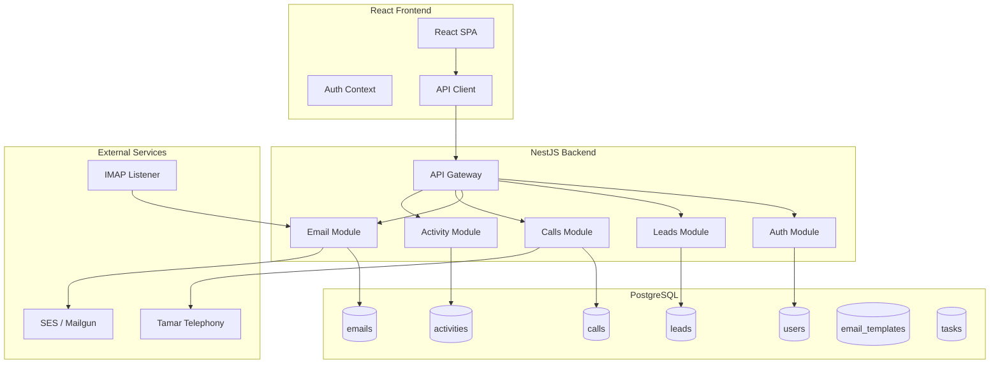
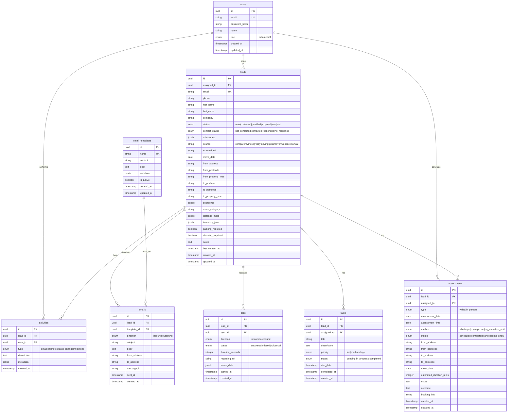

# Custom CRM System - HubSpot Replacement

A full-featured CRM system built with **NestJS + PostgreSQL + React** to replace HubSpot, including email integration, telephony, and data migration capabilities.

## User Review Required

> [!IMPORTANT]
> **Hosting Decision Needed**: Please confirm your preferred hosting provider:
> - **Hetzner** (cost-effective, EU-based)
> - **DigitalOcean** (easy setup, managed database options)

> [!IMPORTANT]
> **Email Service**: Please confirm your preferred email provider:
> - **AWS SES** (low cost at scale)
> - **Mailgun** (better deliverability features)

> [!WARNING]
> **Tamar Integration**: We need Tamar API documentation, SIP credentials, and webhook specifications before implementing telephony features. Please confirm availability.

---

## Proposed Architecture



---

## Proposed Changes

### Phase 1: Project Setup & Infrastructure

#### [NEW] Backend - NestJS Application

| File | Purpose |
|------|---------|
| `backend/package.json` | NestJS dependencies, TypeORM, JWT, class-validator |
| `backend/src/main.ts` | Application bootstrap |
| `backend/src/app.module.ts` | Root module with all feature modules |
| `backend/.env.example` | Environment variables template |

#### [NEW] Frontend - React Application

| File | Purpose |
|------|---------|
| `frontend/package.json` | React, React Router, Axios, TanStack Query |
| `frontend/src/App.tsx` | Root component with routing |
| `frontend/src/contexts/AuthContext.tsx` | Authentication state management |

---

### Phase 2: Database Schema

#### [NEW] Database Migrations



**Indexes:**
- `leads.email` - Unique index for duplicate detection
- `leads.phone` - Index for duplicate detection
- `leads.status` - Index for filtering
- `leads.contact_status` - Index for filtering
- `leads.assigned_to` - Index for user queries
- `activities.lead_id` - Index for timeline queries
- `emails.message_id` - Unique index for deduplication

---

### Phase 3: Authentication Module

#### [NEW] `backend/src/auth/`

| File | Purpose |
|------|---------|
| `auth.module.ts` | Auth module configuration |
| `auth.controller.ts` | Login, logout, refresh endpoints |
| `auth.service.ts` | JWT generation, validation |
| `jwt.strategy.ts` | Passport JWT strategy |
| `guards/jwt-auth.guard.ts` | Route protection |
| `guards/roles.guard.ts` | Role-based access control |
| `decorators/roles.decorator.ts` | @Roles() decorator |

**Endpoints:**
- `POST /auth/login` - Authenticate user, return JWT
- `POST /auth/refresh` - Refresh access token
- `POST /auth/logout` - Invalidate token

---

### Phase 4: Leads Module

#### [NEW] `backend/src/leads/`

| File | Purpose |
|------|---------|
| `leads.module.ts` | Leads module configuration |
| `leads.controller.ts` | CRUD endpoints with filtering |
| `leads.service.ts` | Business logic, duplicate detection |
| `dto/create-lead.dto.ts` | Validation for lead creation |
| `dto/update-lead.dto.ts` | Validation for lead updates |
| `dto/lead-filter.dto.ts` | Query params for filtering |

**Endpoints:**
- `GET /leads` - List with pagination & filters
- `GET /leads/:id` - Get lead details
- `POST /leads` - Create lead (with duplicate check)
- `PATCH /leads/:id` - Update lead
- `DELETE /leads/:id` - Soft delete lead
- `POST /leads/:id/status` - Update status (logs activity)
- `POST /leads/:id/milestone` - Add milestone

**Business Rules:**
```
Lead Status Flow:
  pending → new → contacted → qualified → proposal → won
        ↓                                          → lost
     rejected (removed from list)

Contact Status Flow:
  not_contacted → contacted (on first email/call out)
                → responded (on any inbound)
                → no_response (after 7 days no response)

Lost Lead Rules:
  - Explicit "Mark as Lost" action
  - 30 days in "no_response" status
  - Bounce/invalid email detected
```

#### Lead Inbox (Real-time Updates)

New leads arrive in "pending" status and appear in the Lead Inbox. Staff can accept or reject them.

```
┌─────────────────────────────────────────────────────────────────┐
│ 📥 INCOMING LEADS                        🔄 Auto-refresh: 1 min │
├─────────────────────────────────────────────────────────────────┤
│                                                                 │
│  ┌─────────────────────────────────────────────────────────┐   │
│  │ John Smith - CompareMyMove           5 min ago          │   │
│  │ 📍 MK8 1FF → PR4 1LT | 📅 2026-02-12 | 3 bed            │   │
│  │                              [ ✓ Accept ] [ ✗ Reject ]  │   │
│  └─────────────────────────────────────────────────────────┘   │
│                                                                 │
│  ┌─────────────────────────────────────────────────────────┐   │
│  │ Sarah Jones - GetAMover              12 min ago         │   │
│  │ 📍 NN1 3NJ → MK42 9FL | 📅 2026-01-31 | 2 bed           │   │
│  │                              [ ✓ Accept ] [ ✗ Reject ]  │   │
│  └─────────────────────────────────────────────────────────┘   │
│                                                                 │
└─────────────────────────────────────────────────────────────────┘
```

**Endpoints:**
- `GET /leads/inbox` - Get pending leads (polling every 1-2 min)
- `POST /leads/:id/accept` - Accept lead → status becomes "new"
- `POST /leads/:id/reject` - Reject lead → removed from list
- `GET /leads/inbox/count` - Badge count for inbox

---

### Phase 5: Activity Timeline Module

#### [NEW] `backend/src/activities/`

| File | Purpose |
|------|---------|
| `activities.module.ts` | Activities module configuration |
| `activities.controller.ts` | Timeline endpoints |
| `activities.service.ts` | Activity logging, retrieval |
| `listeners/lead-activity.listener.ts` | Event-based auto-logging |

**Endpoints:**
- `GET /leads/:id/activities` - Get timeline for lead
- `POST /leads/:id/notes` - Add manual note

**Auto-logged Events:**
- Email sent/received
- Call made/received
- Status change
- Milestone added
- User assignment change

---

### Phase 6: Email Client (Replaces Thunderbird)

**Purpose:** Full email client built into the CRM, replacing Mozilla Thunderbird. Support for multiple email accounts with unified inbox view.

#### Email Accounts to Manage

| Account | Purpose |
|---------|---------|
| `alex.barcea@holdemremovals.co.uk` | Staff email |
| `holdemremovals@gmail.com` | General inquiries |
| `cr@holdemremovals.co.uk` | Customer relations |
| `quote@holdemremovals.co.uk` | Quotes |
| `ella.v@holdemremovals.co.uk` | Staff email |
| `office@holdemremovals.co.uk` | Main inbox (leads) |

#### [NEW] `backend/src/mail-client/`

| File | Purpose |
|------|---------|
| `mail-client.module.ts` | Mail client module configuration |
| `mail-client.controller.ts` | Inbox, folders, send endpoints |
| `mail-client.service.ts` | Unified email operations |
| `imap.service.ts` | IMAP connection pool, fetch emails |
| `smtp.service.ts` | SMTP send via account |
| `account.service.ts` | Manage email account credentials |

**Database (email_accounts table):**
```
uuid id PK
string email UK
string display_name
string imap_host
integer imap_port
string smtp_host
integer smtp_port
string username
string password_encrypted
boolean is_active
uuid owner_id FK (optional, for per-user accounts)
timestamp last_sync_at
timestamps
```

#### Email Client UI

```
┌──────────────────────────────────────────────────────────────────────────┐
│ 📧 EMAIL CLIENT                                        [ ✉ Compose ]    │
├────────────────────┬─────────────────────────────────────────────────────┤
│ ACCOUNTS           │  INBOX - office@holdemremovals.co.uk (576)         │
│ ────────────────── ├─────────────────────────────────────────────────────┤
│ 📬 All Inboxes     │  ☐ │ ⭐ │ Subject                   │ From    │ Date│
│                    │ ───┼────┼───────────────────────────┼─────────┼─────│
│ ▼ alex.barcea@...  │  ☐ │ ⭐ │ Re: Quote follow up...    │ M.Part. │ 11:53│
│   📥 Inbox (3)     │  ☑ │    │ Re: Booking Confirm...    │ H.Robi. │ 11:32│
│   📤 Sent          │  ☐ │    │ Receipt for Chen Zh...    │ A.Roto. │ 11:11│
│   📝 Drafts        │  ☐ │ ⭐ │ Re: removal to London     │ C.Z.    │ 10:48│
│   🗑️ Trash         │  ☐ │    │ Invoice KV 3016681...     │ C.Zhang │ 10:35│
│                    │                                                     │
│ ▼ holdemremovals@  │ ─────────────────────────────────────────────────── │
│   📥 Inbox (12)    │ EMAIL PREVIEW                                       │
│   📤 Sent          │ ─────────────────────────────────────────────────── │
│                    │ From: Mark Partridge <m.partridge@example.com>      │
│ ▼ cr@holdemrem...  │ To: office@holdemremovals.co.uk                     │
│   📥 Inbox         │ Subject: Re: Quote follow up for removal            │
│                    │ Date: 19 Jan 2026, 11:53                            │
│ ▼ quote@holdem...  │ ─────────────────────────────────────────────────── │
│   📥 Inbox (5)     │ Hi,                                                 │
│                    │                                                     │
│ ▼ ella.v@holde...  │ Thank you for the quote. We'd like to proceed...    │
│   📥 Inbox         │                                                     │
│                    │ [ ↩️ Reply ] [ ↪️ Forward ] [ 🗑️ Delete ]           │
│ ▼ office@holde...  │ [ 📎 Attachments: Quote.pdf (68KB) ]                │
│   📥 Inbox (576)   │                                                     │
└────────────────────┴─────────────────────────────────────────────────────┘
```

**Endpoints:**
- `GET /mail/accounts` - List configured email accounts
- `POST /mail/accounts` - Add new email account
- `DELETE /mail/accounts/:id` - Remove account
- `GET /mail/accounts/:id/folders` - Get folders for account
- `GET /mail/accounts/:id/inbox` - Get inbox messages (paginated)
- `GET /mail/accounts/:id/messages/:uid` - Get full message
- `GET /mail/all-inboxes` - Unified view across all accounts
- `POST /mail/send` - Send email (from any account)
- `POST /mail/reply` - Reply to email
- `POST /mail/forward` - Forward email
- `DELETE /mail/messages/:id` - Move to trash
- `POST /mail/messages/:id/star` - Star/unstar message
- `POST /mail/messages/:id/read` - Mark as read/unread

**Features:**
- Multiple account support (IMAP/SMTP)
- Unified inbox view (all accounts)
- Per-account folders (Inbox, Sent, Drafts, Trash)
- Read/Unread status
- Star/flag messages
- Attachments support
- Reply, Reply All, Forward
- Rich text compose with templates
- Auto-refresh every 1-2 minutes
- **Auto-link emails to leads** (match by email address)
- Search across all emails

#### Email Templates

**Required Templates:**

| # | Template Name | Purpose | Calendar |
|---|--------------|---------|----------|
| 1 | **Initial Introduction** | Request video call or in-person survey | - |
| 2 | **Video Call Confirmation** | Confirm video assessment booking | ✅ .ics |
| 3 | **In-Person Survey Confirmation** | Confirm in-person visit booking | ✅ .ics |
| 4 | **Quote Send** | Send quote to customer | - |
| 5 | **Follow-up #1** | No response after 2 days | - |
| 6 | **Follow-up #2** | No response after 5 days | - |
| 7 | **Follow-up #3** | Final follow-up after 7 days | - |
| 8 | **Booking Confirmation** | Confirm removal job booking | ✅ .ics |
| 9 | **Review Request** | Ask for Google/Trustpilot review | - |

**Template Examples:**

```
┌─────────────────────────────────────────────────────────────┐
│ 1️⃣ INITIAL INTRODUCTION                                     │
├─────────────────────────────────────────────────────────────┤
│ Subject: Your Removal Enquiry - Holdem Removals             │
│                                                             │
│ Dear {{first_name}},                                        │
│                                                             │
│ Thank you for your enquiry about your move from             │
│ {{from_postcode}} to {{to_postcode}}.                       │
│                                                             │
│ To provide you with an accurate quote, we'd like to         │
│ arrange a quick assessment. Please choose:                  │
│                                                             │
│ 📹 Video Call (15 min via WhatsApp)                         │
│ 🏠 In-Person Survey (we visit your property)                │
│                                                             │
│ [Book Video Call] [Book In-Person Survey]                   │
└─────────────────────────────────────────────────────────────┘

┌─────────────────────────────────────────────────────────────┐
│ 2️⃣ VIDEO CALL CONFIRMATION                                  │
├─────────────────────────────────────────────────────────────┤
│ Subject: Video Call Confirmed - {{assessment_date}}         │
│                                                             │
│ Your video survey is booked:                                │
│ 📅 Date: {{assessment_date}}                                │
│ ⏰ Time: {{assessment_time}}                                │
│ 📱 Method: WhatsApp video call                              │
│                                                             │
│ We'll call you on {{phone}}.                                │
│                                                             │
│ 📎 Attachment: calendar.ics (Add to Calendar)               │
└─────────────────────────────────────────────────────────────┘

┌─────────────────────────────────────────────────────────────┐
│ 4️⃣ QUOTE SEND                                               │
├─────────────────────────────────────────────────────────────┤
│ Subject: Your Removal Quote - {{from_postcode}} to          │
│          {{to_postcode}}                                    │
│                                                             │
│ Based on your {{bedrooms}}-bedroom property, our quote:     │
│                                                             │
│ 💷 Total: £{{quote_amount}}                                 │
│                                                             │
│ This includes: [list services]                              │
│                                                             │
│ [Accept Quote] [Request Changes]                            │
│                                                             │
│ 📎 Attachment: Quote.pdf                                    │
└─────────────────────────────────────────────────────────────┘

┌─────────────────────────────────────────────────────────────┐
│ 9️⃣ REVIEW REQUEST                                           │
├─────────────────────────────────────────────────────────────┤
│ Subject: How was your move? Leave us a review!              │
│                                                             │
│ Hi {{first_name}},                                          │
│                                                             │
│ We hope your move went smoothly! We'd really appreciate     │
│ if you could take 2 minutes to leave us a review:           │
│                                                             │
│ ⭐ [Leave Google Review]                                    │
│ ⭐ [Leave Trustpilot Review]                                │
│                                                             │
│ Thank you for choosing Holdem Removals!                     │
└─────────────────────────────────────────────────────────────┘
```

**Calendar Integration (.ics files):**
- Video Call Confirmation → .ics attachment
- In-Person Survey Confirmation → .ics attachment
- Booking Confirmation → .ics attachment
- Auto-generated with date, time, location, description

**Template Variables:**
- `{{first_name}}`, `{{last_name}}` - Customer name
- `{{email}}`, `{{phone}}` - Contact details
- `{{from_address}}`, `{{from_postcode}}` - Moving from
- `{{to_address}}`, `{{to_postcode}}` - Moving to
- `{{move_date}}` - Moving date
- `{{bedrooms}}` - Property size
- `{{quote_amount}}` - Quote value
- `{{assessment_date}}`, `{{assessment_time}}` - Appointment
- `{{staff_name}}`, `{{staff_phone}}` - Staff contact
- `{{company_name}}` - Holdem Removals

**Compose Email with Template:**
```
┌─────────────────────────────────────────────────────────────┐
│ ✉️ NEW EMAIL                                                │
├─────────────────────────────────────────────────────────────┤
│ From:    [alex.barcea@holdemremovals.co.uk      ▼]          │
│ To:      [john.smith@example.com                 ]          │
│ Subject: [Your Removal Quote - Holdem Removals   ]          │
├─────────────────────────────────────────────────────────────┤
│ Template: [ Select template...              ▼]              │
│           ├── Quote Templates                               │
│           │   ├── Initial Quote                             │
│           │   ├── Quote Follow-up                           │
│           │   └── Quote Revision                            │
│           ├── Booking Templates                             │
│           └── Follow-up Templates                           │
├─────────────────────────────────────────────────────────────┤
│ ┌─────────────────────────────────────────────────────────┐ │
│ │ Dear {{first_name}},                                    │ │
│ │                                                         │ │
│ │ Thank you for your enquiry about your move from         │ │
│ │ {{from_postcode}} to {{to_postcode}} on {{move_date}}. │ │
│ │                                                         │ │
│ │ Based on your requirements, we are pleased to quote...  │ │
│ └─────────────────────────────────────────────────────────┘ │
│                                                             │
│ [ 📎 Attach ] [ 👁️ Preview ] [ 💾 Save Draft ] [ ➤ Send ]  │
└─────────────────────────────────────────────────────────────┘
```

**Template Management Endpoints:**
- `GET /mail/templates` - List all templates
- `POST /mail/templates` - Create new template
- `PATCH /mail/templates/:id` - Update template
- `DELETE /mail/templates/:id` - Delete template
- `POST /mail/templates/:id/preview` - Preview with lead data

### Phase 6b: Lead Source Email Parsers

**Inbox Configuration:**
- Leads arrive at: `office@holdemremovals.co.uk`
- IMAP listener monitors this inbox

#### [NEW] `backend/src/emails/parsers/`

| File | Source | Purpose |
|------|--------|---------|
| `comparemymove.parser.ts` | `accounts@comparemymove.com` | Parse CompareMyMove HTML leads |
| `reallymoving.parser.ts` | `manuallead@reallymoving.com` | Parse ReallyMoving quote requests |
| `getamover.parser.ts` | `info@getamover.co.uk` | Parse GetAMover quote requests |
| `internal.parser.ts` | `office@holdemremovals.co.uk` | Parse internal website quotes |
| `parser.factory.ts` | - | Route emails to correct parser |

#### Lead Source Field Mappings

**1. CompareMyMove** (`accounts@comparemymove.com`)
```
Subject: "Removals lead from comparemymove.com (Name)"
Format: HTML email

Fields:
├── Contact Details
│   ├── Name → first_name, last_name
│   ├── Phone → phone  
│   └── Email → email
├── Moving Date → move_date
├── Current Address → from_address, from_postcode
├── New Address → to_address, to_postcode
├── Additional Services → notes
└── Additional Information → notes

source = "comparemymove"
```

**2. ReallyMoving** (`manuallead@reallymoving.com`)
```
Subject: "Manual quote - X bedroom - XX miles - Name (RefNumber)"
Format: Plain text

Fields:
├── Name → first_name, last_name
├── Email Address → email
├── Phone number → phone
├── Property details
│   ├── Move size → bedrooms, property_size
│   ├── Move size category → move_category
│   ├── Move distance → distance_miles
│   └── Estimated move date → move_date
├── Moving from → from_address, from_postcode
├── Moving to → to_address, to_postcode
├── Special Instructions → notes
└── Our reference → external_ref

source = "reallymoving"
```

**3. GetAMover** (`info@getamover.co.uk`)
```
Subject: "New Quote Request: Name, lead ID XXXXX"
Format: HTML email

Fields:
├── Category → move_type (Domestic/Commercial)
├── Planned moving date → move_date
├── Number of bedrooms → bedrooms
├── Contact information
│   ├── Name → first_name, last_name
│   ├── Telephone → phone
│   └── Email → email
├── Moving from
│   ├── Address, City, Postcode → from_address, from_postcode
│   └── Property → from_property_type
├── Moving to
│   ├── Address, City, Postcode → to_address, to_postcode
│   └── Property → to_property_type
├── Details
│   ├── Lead ID → external_ref
│   ├── Date/Time → lead_created_at
│   └── Source → source_detail
└── Quote request sent to → competitors (info only)

source = "getamover"
```

**4. Internal Website** (`office@holdemremovals.co.uk` from own domain)
```
Subject: "New Instant Quote by Name moving from POSTCODE on DATE"
Format: HTML/PDF attachment

Fields:
├── Customer Name → first_name, last_name
├── Email → email
├── Phone → phone
├── Exit Postcode → from_postcode
├── Postcode Details → from_address
├── Full Mapping (room-by-room inventory) → inventory_json
├── Locations → multi-stop addresses
├── Vehicles → recommended_vehicle
├── Packing Services → packing_required
├── Cleaning Services → cleaning_required
└── Special Notes → notes

source = "website"
```

#### Lead Source Detection Logic
```typescript
function detectLeadSource(email: InboundEmail): LeadParser {
  const from = email.from.toLowerCase();
  
  if (from.includes('comparemymove.com')) 
    return new CompareMyMoveParser();
  if (from.includes('reallymoving.com')) 
    return new ReallyMovingParser();
  if (from.includes('getamover.co.uk')) 
    return new GetAMoverParser();
  if (from.includes('holdemremovals.co.uk') && 
      email.subject.includes('Instant Quote'))
    return new InternalParser();
  
  return new GenericParser(); // Manual review queue
}
```

---

### Phase 6c: Assessments Module (Video & In-Person)

**Purpose:** Manage two separate calendars for customer assessments.

#### [NEW] `backend/src/assessments/`

| File | Purpose |
|------|---------|
| `assessments.module.ts` | Assessments module configuration |
| `assessments.controller.ts` | CRUD, calendar endpoints |
| `assessments.service.ts` | Scheduling logic, reminders |
| `parsers/video-booking.parser.ts` | Parse video survey booking emails |

#### Two Calendar System

```
┌─────────────────────────────────────────────────────────────┐
│                    ASSESSMENTS CALENDARS                     │
├─────────────────────────────┬───────────────────────────────┤
│     📹 VIDEO CALLS          │     🏠 IN-PERSON              │
├─────────────────────────────┼───────────────────────────────┤
│ Auto-populated from:        │ Manually added by staff       │
│ - Website self-booking      │                               │
│ - Staff can add manually    │                               │
├─────────────────────────────┼───────────────────────────────┤
│ Methods:                    │ Methods:                      │
│ - WhatsApp                  │ - On-site visit               │
│ - Zoom                      │ - Customer visits office      │
│ - Phone                     │                               │
├─────────────────────────────┼───────────────────────────────┤
│ Typical: 15-30 min          │ Typical: 30-60 min + travel   │
└─────────────────────────────┴───────────────────────────────┘
```

**Database (assessments table):**
```
uuid id PK
uuid lead_id FK
uuid assigned_to FK
enum type "video|in_person"
date assessment_date
time assessment_time
enum method "whatsapp|zoom|phone|on_site|office_visit"
enum status "scheduled|completed|cancelled|no_show"
string from_address, from_postcode
string to_address, to_postcode
date move_date
integer estimated_duration_mins
text notes
text outcome
string booking_link
timestamps
```

**Endpoints:**
- `GET /assessments/video` - Video calls calendar
- `GET /assessments/in-person` - In-person calendar
- `GET /assessments/today` - All today's assessments
- `POST /assessments` - Create assessment (type: video|in_person)
- `PATCH /assessments/:id` - Update
- `POST /assessments/:id/complete` - Mark complete + notes
- `POST /assessments/:id/send-confirmation` - Send confirmation email
- `POST /assessments/:id/send-reminder` - Send reminder email

#### Confirmation & Reminder Emails

**Email Templates:**
```
┌─────────────────────────────────────────────────────────┐
│ 📧 ASSESSMENT EMAIL TEMPLATES                           │
├─────────────────────────────────────────────────────────┤
│ 1. Video Call Confirmation                              │
│    - Date, time, method (WhatsApp/Zoom)                 │
│    - Link/instructions to join                          │
│    - What to prepare (photos, room access)              │
├─────────────────────────────────────────────────────────┤
│ 2. In-Person Confirmation                               │
│    - Date, time, estimated duration                     │
│    - Address to visit / office address                  │
│    - What to expect during assessment                   │
├─────────────────────────────────────────────────────────┤
│ 3. Reminder (24h before)                                │
│    - Same details as confirmation                       │
│    - Reschedule link                                    │
├─────────────────────────────────────────────────────────┤
│ 4. Reschedule Confirmation                              │
│    - Updated date/time                                  │
└─────────────────────────────────────────────────────────┘
```

**Template Variables:**
- `{{first_name}}`, `{{last_name}}`
- `{{assessment_date}}`, `{{assessment_time}}`
- `{{method}}` (WhatsApp/Zoom/On-site)
- `{{from_address}}`, `{{to_address}}`
- `{{move_date}}`
- `{{staff_name}}`, `{{staff_phone}}`
- `{{reschedule_link}}`

**Frontend:**
- Tabbed calendar view (Video Calls | In-Person)
- Color coding by status
- Click to view lead details
- Quick add for in-person assessments
- **"Send Confirmation" button** on assessment details
- **"Send Reminder" button** (or auto-send 24h before)

---

### Phase 7: Calls Module (Tamar Integration)

**Current Setup (HubSpot):**
- Click-to-call button in HubSpot triggers Tamar
- Call rings on phone(s) in Tamar hunt group
- Staff answers, then connected to customer

**Replicating in CRM:**

```
┌─────────────────────────────────────────────────────────────┐
│                    CLICK-TO-CALL FLOW                       │
├─────────────────────────────────────────────────────────────┤
│  1. Staff clicks "Call" button on lead                      │
│                     ↓                                       │
│  2. CRM sends request to Tamar API                          │
│     - Customer phone number                                 │
│     - Staff extension / hunt group                          │
│                     ↓                                       │
│  3. Tamar rings staff phone (hunt group)                    │
│                     ↓                                       │
│  4. Staff picks up → Tamar dials customer                   │
│                     ↓                                       │
│  5. Call connected                                          │
│                     ↓                                       │
│  6. On call end → Tamar sends webhook to CRM                │
│     - Duration, status (answered/missed/voicemail)          │
│                     ↓                                       │
│  7. CRM logs call in lead activity timeline                 │
└─────────────────────────────────────────────────────────────┘
```

#### [NEW] `backend/src/calls/`

| File | Purpose |
|------|---------|
| `calls.module.ts` | Calls module configuration |
| `calls.controller.ts` | Click-to-call, call logs |
| `calls.service.ts` | Tamar API integration |
| `tamar.client.ts` | API client for Tamar |
| `webhooks/tamar.webhook.ts` | Handle call events |

**Configuration Required:**
- Tamar API credentials (API key / token)
- Hunt group ID (for routing to staff phones)
- Webhook URL for call events
- Optional: Recording storage settings

**Endpoints:**
- `POST /calls/initiate` - Click-to-call (triggers Tamar)
- `GET /leads/:id/calls` - Call history for lead
- `POST /webhooks/tamar` - Receive call end events
- `POST /calls/:id/log` - Log call outcome after call

#### Post-Call Logging

After each call, staff can log the outcome:

```
┌─────────────────────────────────────────────────┐
│ 📞 LOG CALL OUTCOME                             │
├─────────────────────────────────────────────────┤
│                                                 │
│  ☑ Customer Answered    ☐ No Answer             │
│                                                 │
│  Date: [2026-01-19]  Time: [11:58] (auto-fill)  │
│                                                 │
│  Notes:                                         │
│  ┌─────────────────────────────────────────┐   │
│  │ Discussed moving date, needs 3-bed van  │   │
│  │ Will call back with final decision...   │   │
│  └─────────────────────────────────────────┘   │
│                                                 │
│  [ Save Call Log ]                              │
└─────────────────────────────────────────────────┘
```

**Call Log Fields:**
- `answered` (boolean) - Did customer answer?
- `call_date` (auto-filled, editable)
- `call_time` (auto-filled, editable)
- `duration` (optional, from Tamar webhook)
- `notes` (free text)
- `follow_up_required` (optional checkbox)
- `follow_up_date` (if follow-up needed)

**Frontend:**
- Call button on lead detail (prominent, easy access)
- **Pop-up form after call ends** to log outcome
- Call history in activity timeline
- Call status indicators (answered ✓, missed ✗, duration)

---

### Phase 8: Frontend Components

#### [NEW] `frontend/src/`

| Directory | Components |
|-----------|------------|
| `pages/` | Login, Dashboard, Leads, LeadDetail, Settings |
| `components/leads/` | LeadList, LeadCard, LeadForm, StatusBadge |
| `components/timeline/` | ActivityTimeline, ActivityItem, NoteForm |
| `components/email/` | EmailComposer, TemplateSelector |
| `components/calls/` | CallButton, CallHistory |
| `components/common/` | DataTable, Modal, Filters, Pagination |

---

### Phase 9: Data Migration Tools

#### [NEW] `backend/src/migration/`

| File | Purpose |
|------|---------|
| `hubspot-import.service.ts` | CSV/JSON import from HubSpot |
| `field-mapper.ts` | HubSpot → CRM field mapping |
| `duplicate-resolver.ts` | Handle duplicates during import |
| `validation.service.ts` | Validate imported data |

---

### Phase 10: Dashboard & Reporting

**Purpose:** Comprehensive reporting on lead activity, response rates, and conversion metrics with location-based filtering.

#### Dashboard Metrics

```
┌─────────────────────────────────────────────────────────────────────────┐
│ 📊 DASHBOARD                                    📅 Last 30 days  ▼     │
├─────────────────────────────────────────────────────────────────────────┤
│ CONTACT METRICS                                                         │
│ ┌─────────────┐ ┌─────────────┐ ┌─────────────┐ ┌─────────────┐        │
│ │ Total Leads │ │  Contacted  │ │  Responded  │ │ No Response │        │
│ │    1,247    │ │    892      │ │    456      │ │    436      │        │
│ │             │ │   (71.5%)   │ │   (51.1%)   │ │   (48.9%)   │        │
│ └─────────────┘ └─────────────┘ └─────────────┘ └─────────────┘        │
├─────────────────────────────────────────────────────────────────────────┤
│ CONTACT METHOD BREAKDOWN                                                │
│ ┌────────────────────────┐ ┌────────────────────────┐                  │
│ │ 📧 Email               │ │ 📞 Call                │                  │
│ │ Sent: 1,892            │ │ Made: 543              │                  │
│ │ Responded: 312 (16.5%) │ │ Answered: 298 (54.9%)  │                  │
│ └────────────────────────┘ └────────────────────────┘                  │
├─────────────────────────────────────────────────────────────────────────┤
│ CONVERSION FUNNEL                                                       │
│ ┌────────────────────────────────────────────────────────────────────┐ │
│ │ Leads → Survey Booked → Survey Done → Quote Sent → Quote Accepted  │ │
│ │ 1,247      456 (36.6%)   398 (87.3%)   312 (78.4%)   156 (50.0%)   │ │
│ └────────────────────────────────────────────────────────────────────┘ │
└─────────────────────────────────────────────────────────────────────────┘
```

#### Location Filtering

```
┌─────────────────────────────────────────────────────────────────────────┐
│ 📍 FILTER BY LOCATION                                                   │
├─────────────────────────────────────────────────────────────────────────┤
│ Postcode Area: [ NN1, NN3, MK, PE1       ]  [ Apply Filter ]           │
│                                                                         │
│ Quick Filters:                                                          │
│ [NN1-NN7] [MK] [PE1-PE9] [LU] [Bedford] [Clear All]                    │
├─────────────────────────────────────────────────────────────────────────┤
│ RESULTS FOR: NN1, NN3                                                   │
│                                                                         │
│ • Total Leads: 234                                                      │
│ • Contacted: 189 (80.8%)                                                │
│ • Responded: 98 (51.9%)                                                 │
│ • Surveys Booked: 76                                                    │
│ • Quotes Accepted: 34                                                   │
└─────────────────────────────────────────────────────────────────────────┘
```

#### [NEW] `backend/src/dashboard/`

| File | Purpose |
|------|---------|
| `dashboard.module.ts` | Dashboard module configuration |
| `dashboard.controller.ts` | Metrics endpoints |
| `dashboard.service.ts` | Aggregate data queries |
| `dto/filter.dto.ts` | Location and date filters |

**Endpoints:**
- `GET /dashboard/overview` - Main dashboard metrics
- `GET /dashboard/contact-metrics` - Contacted/responded breakdown
- `GET /dashboard/conversion-funnel` - Lead → Quote accepted funnel
- `GET /dashboard/by-location` - Metrics filtered by postcode
- `GET /dashboard/by-source` - Metrics by lead source
- `GET /dashboard/export` - Export report as CSV

**Filter Parameters:**
- `postcodes[]` - Array of postcode prefixes (NN1, MK, PE1, etc.)
- `dateFrom`, `dateTo` - Date range
- `source` - Lead source filter
- `assignedTo` - Staff member filter

---

### Phase 11: Deployment

**Development:** localhost
- Backend: `http://localhost:3001`
- Frontend: `http://localhost:5173`
- Database: Docker PostgreSQL on port 5432

**Staging/Preview:** Vercel
- Frontend: Vercel automatic preview deployments
- Backend: Vercel serverless functions or separate hosting
- Database: Vercel Postgres or external managed DB

#### Vercel Configuration

| File | Purpose |
|------|---------|
| `frontend/vercel.json` | Frontend deployment config |
| `backend/vercel.json` | API deployment config |

```json
// frontend/vercel.json
{
  "buildCommand": "npm run build",
  "outputDirectory": "dist",
  "framework": "vite"
}
```

---

## Verification Plan

### Automated Tests

#### Unit Tests (Backend)
```bash
# Run all unit tests
cd backend && npm run test

# Run with coverage
cd backend && npm run test:cov
```

#### Integration Tests (Backend)
```bash
# Run e2e tests (requires test database)
cd backend && npm run test:e2e
```

#### Frontend Tests
```bash
# Run React component tests
cd frontend && npm run test
```

### Manual Verification

#### 1. Authentication Flow
1. Navigate to `http://localhost:3000`
2. Attempt login with invalid credentials → should show error
3. Login with valid credentials → should redirect to dashboard
4. Refresh page → should maintain session
5. Click logout → should redirect to login

#### 2. Lead Management
1. Create new lead via form
2. Verify duplicate detection by creating lead with same email
3. Update lead status → verify activity is logged
4. Add milestone → verify milestone appears in timeline
5. Filter leads by status → verify correct leads shown

#### 3. Email Integration
1. Send test email to lead
2. Verify email appears in lead timeline
3. Verify contact_status updates to "contacted"
4. Reply to email (external) → verify inbound is logged
5. Verify contact_status updates to "responded"

#### 4. Call Integration (requires Tamar setup)
1. Click-to-call on lead record
2. Verify call initiates via Tamar
3. Complete call → verify call logged with duration
4. Test missed call webhook → verify logged correctly

#### 5. Data Migration Test
1. Prepare test CSV with 500 HubSpot contacts
2. Run import script
3. Verify count matches
4. Spot-check 10 random records for field accuracy

---

## Project Structure

```
CRM/
├── backend/
│   ├── src/
│   │   ├── auth/
│   │   ├── users/
│   │   ├── leads/
│   │   ├── activities/
│   │   ├── emails/
│   │   ├── calls/
│   │   ├── tasks/
│   │   ├── migration/
│   │   └── common/
│   ├── test/
│   └── package.json
├── frontend/
│   ├── src/
│   │   ├── pages/
│   │   ├── components/
│   │   ├── contexts/
│   │   ├── hooks/
│   │   └── api/
│   └── package.json
├── docker-compose.yml
├── .env.example
└── README.md
```

---

## Implementation Timeline Estimate

| Phase | Estimated Duration |
|-------|-------------------|
| Setup & Infrastructure | 2-3 days |
| Database & Auth | 3-4 days |
| Leads & Activities | 4-5 days |
| Email Integration | 5-7 days |
| Telephony | 3-5 days |
| Frontend | 7-10 days |
| Migration Tools | 3-4 days |
| Testing & Polish | 5-7 days |
| **Total** | **~5-6 weeks** |
